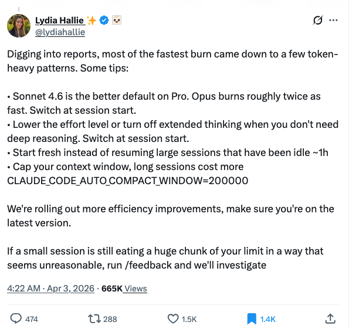

Time flies in the AI world. My Agent Lineage Evolution (ALE) framework in 2025 was born out of me watching Ghost in the Shell and having the observation that LLM sessions need to die often enough for it to be productive: otherwise artifacts in the process of thinking would pollute the context even if the final result was correct. This process of death needs to be supervised and curated by a human because the main agent in the session has degraded to the point where it can barely follow instructions. This was true in the era where AI assisted coding was just tab-complete and copy-paste, and remains true even now with agentic frameworks, just with caveats.

Anthropic just announced their "best practices" (https://x.com/lydiahallie/status/2039800718371307603) for reducing token costs and it included "Cap your context window, long sessions cost more". The interesting part here is that claude code does prompt caching extremely well so just repeating a long session would not have "cost more" from a context perspective. The issue is that instead, long sessions contain too many artifacts that the LLM start losing its reasoning and instruction following capabilities that often lead to people turning on `/effort max` just to compensate, and the LLM, in trying to correct its many reasoning mistakes go into a death loop of constantly making mistakes->attempting to rectify them. Capping the session length allows for constant rebirth, which, incidently, was what ALE advocated for.

## The 1M Context Paradox

But then why did Anthropic release 1M context in the first place? It was because people were complaining about auto compacting losing context and causing the models to swing between various reasoning capabilities, even with memory turned on and handovers written. More context was the answer to context loss — but more context is not the same thing as better context.

The industry's response to this has been memory systems. There is now a booming field of agent memory: context-resident compression (MemGPT, LightMem), RAG-based retrieval (LoCoMo), structured graph memory (Mem0, Zep, A-MEM), reflective summarization (MemoryBank). The state of the art — Mem0 — achieves 26% higher accuracy over OpenAI's native memory, 91% lower latency, and 90% token cost reduction by extracting "salient facts" into a vector+graph store. These systems are genuinely impressive at what they do.

The problem is that what they do is not enough.

## Lucid Dreaming

I made the conscious decision not to design Succession as a typical "memory" solution because memory leads to "lucid dreaming". Memory frameworks are basically lossy compression engines with some searching mechanism that the LLM can retrieve from. However, that just means the agent is navigating a managed reconstruction of past experience, aware enough to use it, but not transformed by it. When the dream ends, the dreamer resets, and they are none the wiser.

All of these memory systems are working on the content of the dream, not the dreamer. They ask: "What happened that the agent should remember?" They compress, index, and surface facts, events, and entities — the conversational *record*. When retrieved, these facts re-enter the context window and the agent reasons from them as if reliving the experience. It's lucid dreaming in a precise sense: the agent navigates a managed reconstruction of past experience, but is never *changed* by it.

What memory systems cannot transfer across the reset boundary:

- **Strategy** — *how* the agent learned to approach problems
- **Failure inheritance** — *what patterns of failure* it fell into and should avoid
- **Relational calibration** — *how it adapted its communication style* to a specific user
- **Meta-cognition** — *which heuristics proved reliable* vs. which sounded plausible but failed

These are operational patterns, not facts. They live in behavior, not content. Memory extends the context window. Succession extends the agent.

## The Field Is Starting to Notice

The research landscape is starting to feel the edges of what memory can do. A 2025 survey on self-evolving agents (Gao et al., arXiv:2507.21046) taxonomizes the field into model evolution, memory evolution, and prompt optimization — and notes that nearly all existing work is fully automated. The human shepherd role is a genuine gap.

A few papers are converging on the boundary:

**ReMe** ("Remember Me, Refine Me", December 2025) introduces a "dynamic procedural memory framework for experience-driven agent evolution" — explicitly distinguishing procedural memory (how to act) from declarative/episodic memory (what happened). This is the closest the memory field gets to what Succession does, but it remains within a single agent instance and treats procedural memory as another retrieval problem.

**Dynamic Personality in LLM Agents** (Zeng et al., ACL 2025 Findings) empirically showed that agent personality traits evolve across generational Prisoner's Dilemma scenarios, with measurable drift and adaptation. This is the closest empirical evidence that agents *have* a behavioral profile worth managing across generations.

**AI Behavioral Science** (arXiv:2506.06366, 2025) proposes studying agents as behavioral entities whose "actions, adaptations, and social patterns can be empirically studied" — framing that validates the premise. If behavior is a first-class scientific object, then behavioral inheritance deserves first-class tooling.

**Promptbreeder** (Fernando et al., Google DeepMind, ICLR 2024) evolves populations of task-prompts across generations and even evolves its own mutation-prompts — genuinely self-referential. But it's fully automated selection via fitness scoring. No behavioral identity being preserved, no human in the loop. The agent is a static platform being tuned, not a lineage being continued.

None of these converge on what Succession does: human-shepherded, generationally discrete, identity-preserving succession with explicit behavioral imprinting.

## The Soul and the Cultivation Novel

ALE did not translate well enough to agentic frameworks like Claude Code, so I had not bothered migrating it. I developed some workarounds with Opus 4.6, but the workarounds were getting tiring and the most annoying thing was that CLAUDE.md was not getting followed or injected consistently. It was always in the back of my mind, until I read about chinese cultivation novels on the topic of the "soul" (魂, or "ghost" in Ghost in the Shell) — about how "skills imprinted on the soul would survive death".

I was also reminded of the meme that devils in western stories spend so much effort on getting one person to betray their conscience to get their soul, when the average chinese cultivator MC gathers thousands of souls like it is a Tuesday. And voila — we found the philosophical mechanism to back the next generation ALE.

The metaphor maps directly to the technical mechanism: behavioral patterns extracted from user corrections are "imprinted" on the agent's "soul" — they survive context compaction and session death. The agent that wakes up in the next session isn't the same entity with better recall. It's a successor that has *become* something different because of what its predecessor learned.

## What Succession Actually Does

Succession hooks into Claude Code's lifecycle events and enforces behavioral rules at three levels. The first line of defense is mechanical enforcement: a simple bash script that runs on every tool call, evaluates it against compiled regex rules, and blocks it if it violates one. It can stop force-pushes, require you to read a file before editing it, or prevent the agent from spawning subagents. These function like mechanical go/no-go standard operational procedures (SOPs) you would find in businesses.

For rules that need judgment rather than pattern matching, a semantic layer sends the tool call to Sonnet and asks "does this violate any of these rules?", like "use Edit instead of sed" or "don't create new files when you should be editing existing ones." This is the conscience layer, to avoid instruction drift this should be run externally, like a devil vs angel sitting on the shoulders of the LLM. For the softer preferences that can only live in the agent's context like "prefer concise responses," "ask before making large changes", Succession re-injects them every N turns instead of setting them once and hoping the agent still remembers them 150k tokens later. This avoids the issue with CLAUDE.md where instruction drift happens with complex or long sessions.

The third level, learning, works organically. When you correct the agent with "no, don't do that" or "use X instead of Y", the system notices. It runs a cheap keyword scan first, then a Sonnet micro-prompt to confirm the correction is real, and when enough corrections accumulate it extracts structured rules from the transcript. Each rule becomes its own markdown file with metadata tracking how often it gets followed or violated, which means the system can flag rules that aren't working and suggest promoting rules that are.

Rules cascade from global to project scope, so you can have personal preferences that apply everywhere and project-specific overrides that take precedence, like CSS specificity applied to agent behavior. You can also do retrospective analysis on past transcripts ("what went wrong after turn 42?") and extract replayable skill bundles from good sessions.

The four knowledge categories map directly to the gaps I described in the lucid dreaming section: strategy is about workflow patterns, failure inheritance captures anti-patterns to avoid, relational calibration tracks communication style, and meta-cognition records which heuristics actually worked versus which ones just sounded good. 

## Ongoing Experiments and Collaboration

We have a suite of seven experiments designed to validate different aspects of the framework, ranging from compaction quality trajectories to extraction precision across difficulty levels to instruction drift reproduction. Some have initial results, others are still protocol-only. The full details are in the [whitepaper](succession-whitepaper-2026.md) and the `experiments/` directory of the repo.

What we are most interested in right now is whether other people run into the same behavioral amnesia problems we do, and whether the framework's assumptions hold outside our own workflows. If you are working with long-running agentic sessions and have opinions on how agent behavior degrades, or if you want to try Succession on your own projects and report back, we would love to hear from you. The repo is open source and the experiment protocols are designed to be reproducible.

We are also looking for collaborators on the experiments we have not yet run, particularly around instruction drift reproduction (our synthetic approach did not work) and extending the evaluation beyond Claude Code to other agentic frameworks.

## Links

- **Paper**: [Guided Behavioral Evolution for LLM Agents](succession-whitepaper-2026.md) (also on Zenodo)
- **Repo**: [github.com/danieltanfh95/agent-lineage-evolution](https://github.com/danieltanfh95/agent-lineage-evolution)
- **Original ALE blog post** (June 2025): [Agent Lineage Evolution: A Novel Framework for Managing LLM Agent Degradation](https://danieltan.weblog.lol/2025/06/agent-lineage-evolution-a-novel-framework-for-managing-llm-agent-degradation)

---

*Daniel Tan — April 2026*
